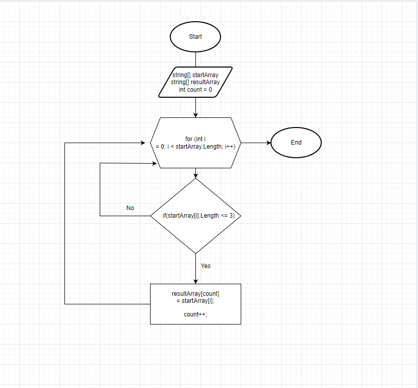

# Итоговая проверочная работа

## Задача

1. Создать репозиторий на GitHub
2. Нарисовать блок-схему алгоритма (можно обойтись блок-схемой основной содержательной части, если вы выделяете её в отдельный метод)
3. Снабдить репозиторий оформленным текстовым описанием решения (файл README.md)
4. Написать программу, решающую поставленную задачу
5. Использовать контроль версий в работе над этим небольшим проектом (не должно быть так, что всё залито одним коммитом, как минимум этапы 2, 3, и 4 должны быть расположены в разных коммитах)

### Решение задачи.
1. Блок-схема задачи

2. Написание программы (Первый этап)

* Просим пользователя ввести произвольный массив через пробел
* Выводим сформированный массив на экран

3. Написание программы (Второй этап)

* Создаем пустой массив, в который будем складывать результат функции сортировки
* Создаем функцию сортировки, где в цикле перебираем каждый элемент пользовательского массива. Делаем проверку условия, где колличество символов элемента <=3. Подходящие под условия элементы добавляем в итоговый массив.
* Выводим на экран итоговый сформированный массив
